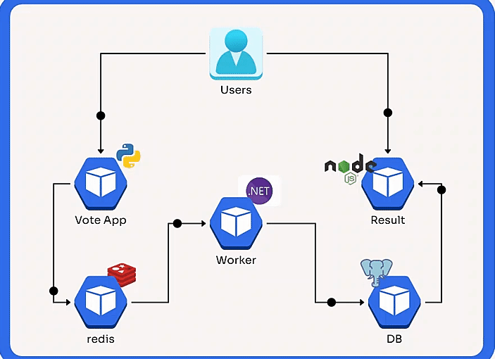

# Modded Example Voting App
This repository is a modified version of the [Votingapp](https://github.com/dockersamples/example-voting-app), a simple distributed application running across multiple Docker containers. The modifications include the addition of Helm charts, Jenkins files, and Terraform scripts to streamline infrastructure provisioning, deployment, and CI/CD processes.


## Overview

The Voting App is a sample application that demonstrates the deployment of a multi-container application using Docker. The application is composed of the following services:

1. Voting Service: A web front-end for voting, written in Python.
2. Redis: A simple in-memory database that stores votes.
3. Worker: A background process that consumes the vote from Redis and stores it in the database, written in .NET Core.
4. PostgreSQL: A relational database that stores the results.
5. Result Service: A web front-end that shows the results, written in Node.js.

## Modifications
### 1. Terraform for Infrastructure Provisioning

Terraform scripts have been added to automate the provisioning of infrastructure on azure cloud platform. The scripts can set up the necessary infrastructure components such as Kubernetes clusters, networking, and storage.

### Infrastructure Components Provisioned by Terraform
- `Azure Virtual Network`: Creates a virtual network with a subnet, public IP, and a security group configured with the necessary security rules.
- `Linux Virtual Machine`: Provisions a Linux virtual machine with the following tools pre-installed:
    - Jenkins
    - Docker
    - kubectl
    - Helm
    - SonarQube
    - Trivy
- `Azure Container Registry (ACR)`: Sets up an Azure Container Registry for storing Docker images.
- `Azure Kubernetes Service (AKS)`: Provisions an AKS cluster with a single node.
- `ACR Integration with AKS`: Configures the provisioned ACR to be accessible by the AKS cluster.


### 2. Helm Chart Integration
Helm charts have been created to package the application, making it easier to deploy and manage in a Kubernetes environment. The charts handle the setup and configuration of all necessary components, including the Voting service, Redis, Worker, PostgreSQL, and the Result service.

### 3. Jenkins Pipeline
Jenkins files have been added to automate the CI/CD pipeline. The pipeline automates the process of building Docker images, running tests, and deploying the application to a Kubernetes cluster using the Helm charts.

### 4. Improved Documentation
The documentation has been enhanced to reflect these changes, providing clear instructions on how to deploy the application using Terraform, Helm, and Jenkins.

## Getting Started
### Prerequisites
- `Terraform`: Ensure Terraform is installed for infrastructure provisioning.
- `Docker`: Docker should be installed and running on your local machine.
- `Kubernetes`: A running Kubernetes cluster is required (can be provisioned using Terraform).
- `Helm`: Helm must be installed to deploy the application.
- `Jenkins`: Jenkins should be set up and configured to run the provided pipeline.


### Infrastructure Provisioning with Terraform

 Clone the Repository
 ```shell
 git clone https://github.com/asifcopilot/example-voting-app-modded.git
cd example-voting-app-modded
```

1. `Initialize Terraform` :  Navigate to the Terraform directory and initialize Terraform:

```shell
cd terraform
terraform init
```
2. `Plan and Apply`: Change the `var.tf` file according to your requirements. Review the infrastructure changes using the `plan` command, then apply them

```shell
terraform plan
terraform apply
```
This will provision the necessary infrastructure components, such as a Kubernetes cluster and any required networking resources.


## Run the app in Kubernetes

The folder k8s-specifications contains the YAML specifications of the Voting App's services.

Run the following command to create the deployments and services. Note it will create these resources in your current namespace (`default` if you haven't changed it.)

```shell
kubectl create -f k8s-specifications/
```

The `vote` web app is then available on port 31000 on each host of the cluster, the `result` web app is available on port 31001.

To remove them, run:

```shell
kubectl delete -f k8s-specifications/
```
#### `(New Added)` Deploying the Voting App Using Helm on Kubernetes

The k8s-helm folder contains all the Helm charts for the Voting App's services.

Run the following command to deploy the Voting App using the Helm charts:
```shell
helm install vote-helm k8s-helm/ -n <namespace>
```
To remove the deployment, run:

```shell
helm uninstall vote-helm -n <namespace>
```
This command will deploy the entire application stack into your Kubernetes cluster.


### Set Up Jenkins Pipeline
- Configure your Jenkins server to use the provided Jenkinsfile.
- The pipeline will automatically build the Docker images, push them to your Docker registry, and deploy the application using Helm.


